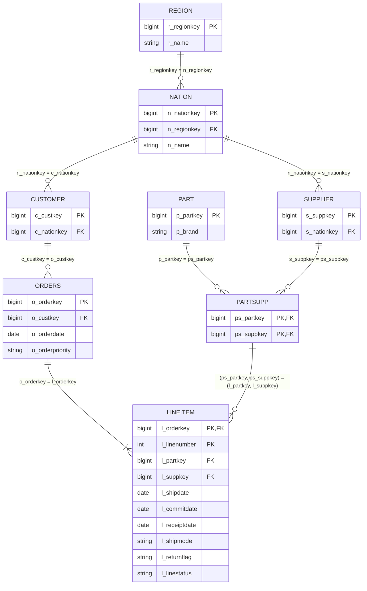

# Design — Logistics lakehouse on `samples.tpch`

Status: **partly agreed** (see [plan.md](plan.md), gate P1): §2 config (D9), §3.1 run_id and DQ interface (D15) and §6 allowed-list procedure (D13) agreed on 2026-10-07; the other contracts (D5–D7, D10–D12, D14) are still proposed.
Requirements are in [requirements.md](requirements.md). The PDF `group_assignment_1.pdf` is authoritative.

Tags used below:
- **[VERIFY]**: a source-schema detail or platform capability not yet confirmed in a real Databricks workspace.
- **[PROFILE]**: a value that must come from profiling the actual source. It is not filled in until that has been done.

---

## 1. Scope and approach

| Item | Decision |
|---|---|
| Source | `samples.tpch` (8 tables), configurable (`source` parameter) |
| Bronze | all 8 tables, as-is plus 2 metadata columns |
| Silver | all 8 tables, 3NF, published only after validation passes |
| Gold | Logistics profile only (§5.2 Q1–Q4 + delay-rate monitoring) |
| Code | Databricks notebooks in `.py` source format (PySpark + SQL), run in order by `run_pipeline` |
| Visuals | `display()` charts inside the analysis notebook (the PDF allows a notebook *or* a dashboard) |
| Optional | AI/BI dashboard, Databricks Job, SQL alert. None of these is an acceptance gate. |

**Why all 8 tables.** The PDF frames the work as a *migration* to a lakehouse (§1, p.1), and it asks for an ER diagram of the Silver tables (§3.4, p.3). Logistics only needs `orders` and `lineitem` for its answers. The two-column reference `lineitem (l_partkey, l_suppkey) → partsupp` and the `part`/`supplier`/`customer`/`nation`/`region` references can only be checked when those tables exist. The extra tables cost little because they all use the same pattern. The PDF does not state the expected ingestion scope, so this is our choice (decision D2 in plan.md).

## 2. Configuration and naming

Everything is driven by `notebooks/00_config.py`, which is loaded with `%run`. Nothing else may hard-code a catalog, schema or source name.

| Parameter (widget) | Default | Notes |
|---|---|---|
| `catalog` | `workspace` | Exists and is the current catalog in Nazar's workspace (NAZ-01, 2026-10-07; `SHOW CATALOGS` → `samples`, `system`, `workspace`). Write access verified: schema and table creation passed (NAZ-03 run 2, 2026-10-07, D8). The first attempt was denied until the user had `CREATE SCHEMA` on the catalog. |
| `schema_prefix` | `nachalniki_logistics` | A different prefix gives a fully independent copy (portability and rerun tests) |
| `source` | `samples.tpch` | `<catalog>.<schema>` of the source |

Derived schemas, all in `{catalog}`:

| Schema | Content | Lifecycle |
|---|---|---|
| `{prefix}_bronze` | raw copies | replaced on each run |
| `{prefix}_staging` | proposed Silver (`stg_<table>`) | replaced on each run, never used by Gold |
| `{prefix}_silver` | published 3NF tables | replaced only after validation passes |
| `{prefix}_gold` | Logistics facts and aggregates | replaced only after Silver is published |
| `{prefix}_audit` | `pipeline_runs`, `dq_check_results` | **append-only**, never overwritten |

Table names inside each schema stay the same as in the source (`lineitem`, `orders`, …) in Bronze and Silver. Gold uses `fct_*` and `agg_*`. Allowed categorical values (see §6) are constants in `00_config.py`, filled in from profiling.

Names provided by `00_config` after `%run ./00_config` (D9). Other notebooks use these names and never build catalog or schema names themselves. Renaming or removing one is a contract change.

| Name | Content |
|---|---|
| `catalog`, `schema_prefix`, `source` | widget values (table above) |
| `bronze_schema`, `staging_schema`, `silver_schema`, `gold_schema`, `audit_schema` | full schema names `{catalog}.{prefix}_bronze` … `{catalog}.{prefix}_audit` |
| `TPCH_TABLES` | the 8 source table names of §4 |
| `ALLOWED_SHIP_MODES`, `ALLOWED_RETURN_FLAGS`, `ALLOWED_LINE_STATUSES` | allowed values, built by the §6 procedure |
| `new_run_id()`, `require_run_id()` | run_id helpers (§3.1) |

"Assume only pre-production data" (§3.2): the code must not depend on exact row counts or values of this sample. Counts are compared *between layers*, not against hard-coded numbers.

## 3. Pipeline lifecycle (one run)

```
run_pipeline
 1. append pipeline_runs(run_id, 'started', ...)
 2. 01_bronze_ingest   source ─► {prefix}_bronze.*         (as-is copy, original data preserved)
 3. 02_silver_stage    bronze ─► {prefix}_staging.stg_*     (casts/renames only, NO row filtering, NO constraints)
 4. 03_validate        all DQ rules on staging (+ source/bronze counts)
                       ─► append dq_check_results(run_id, ...)
                       ─► raise if any blocking rule failed   ── run stops here, Silver/Gold untouched
 5. 04_silver_publish  staging ─► {prefix}_silver.*  + NOT NULL/CHECK (enforced) + PK/FK (informational)
 6. 05_gold_build      silver ─► {prefix}_gold.*  + gold reconciliation rules appended to dq_check_results
                       ─► raise if any gold rule failed
 7. append pipeline_runs(run_id, 'succeeded', ...)
```

- `run_pipeline` executes the steps with `%run` in one notebook context, so `run_id` and the config are shared. It starts a fresh `run_id` on every execution (§3.1). Any exception stops all later cells, so no `succeeded` row is written. Shown on serverless job runs (NAZ-04, 2026-10-07): variables defined by a `%run` child are visible to the caller, and an exception raised inside a `%run` child skips the child's remaining cells and every later caller cell, so the run ends `FAILED`. Interactive serverless sessions were not tested.
- **Invalid rows are never silently dropped.** Staging keeps every source row. If a blocking rule fails, the whole run fails, and the violation count plus up to 10 sample keys are saved in `dq_check_results`.
- The enforced constraints are added in step 5, after validation has passed. They are defence in depth. If one rejects data at this point, the validation has a bug, and the run fails.
- **After a failed run**, the Silver/Gold tables from the last successful run still exist, but they are *not current*. `06_analysis` therefore starts by reading `pipeline_runs`. If the most recent `run_id` has no `succeeded` row, it stops with a message showing the failed run, so stale outputs cannot be presented as current. The failed candidate stays in staging for debugging. (Partial failure: if step 6 fails, Silver is new but Gold is not. The run is still not `succeeded`, so the same guard applies.)
- `pipeline_runs` columns: `run_id` (string uuid), `event` (`started`/`succeeded`), `event_ts`, `catalog`, `schema_prefix`, `source`.
- `dq_check_results` columns: `run_id`, `run_ts`, `rule_id`, `layer` (`source`/`bronze`/`staging`/`gold`), `table_name`, `violation_count` (bigint), `sample_keys` (string, ≤10), `severity` (`blocking`), `passed` (boolean).

### 3.1 run_id, DQ interface and ownership — **agreed (D15, D16; 2026-10-07)**

This interface is agreed before Stage 1 is built, so that each stage runs on its own and later integration does not require rewriting earlier stages. Owners follow the stage split in [plan.md](plan.md#shared-interfaces-and-owners).

**run_id (helpers in `00_config`, owner Nazar).**
- `00_config` defines two helpers and **never assigns `run_id` itself**:
  - `new_run_id()` returns a fresh `str(uuid.uuid4())`.
  - `require_run_id()` returns the `run_id` defined by the calling execution, and raises if none is defined.
- An **execution** is one top-to-bottom run of an entry notebook. Every execution explicitly starts a fresh id with `run_id = new_run_id()` in its own cell, right after `%run ./00_config` and before any step, **even if the notebook session already holds a `run_id`** from an earlier execution. "Keep it if it already exists" is not used, because that would reuse an earlier execution's id on a rerun in the same session.
- **Child notebooks** (`02`–`05`, `dq_helpers`) only read the id with `require_run_id()` and never assign it, so every step of one execution shares the id its entry point started. A step opened on its own, without an entry point, fails fast instead of inventing an id.
- Entry points:
  - **Full pipeline**: `run_pipeline` (owner Max).
  - **Silver stage execution** (Stage 2 development and its demo, before `run_pipeline` exists), each line in its own cell: `%run ./00_config` → `run_id = new_run_id()` → `%run ./02_silver_stage` → `%run ./03_validate` → `%run ./04_silver_publish`. An exception in `03_validate` stops the cells after it, so `04` does not execute. Stage executions write `dq_check_results` but not `pipeline_runs`.
- Re-running a single cell of an entry notebook is not a new execution. Run the entry notebook from the top.
- Stage 1 does not use `run_id`: `01_bronze_ingest` and `profile_source` need only `00_config`, and Bronze never reads or writes audit tables.
- Shown on serverless job runs (NAZ-04, 2026-10-07): a `run_id` assigned in the caller is visible inside a `%run` child and is unchanged after that child itself runs `%run` of a config stand-in that does not assign it. Widget values (defaults or job parameters) that the caller sees are the values a `%run` child reads. Widget values typed in the notebook UI were not tested.

**`dq_check_results` (owner Yaropolk, `notebooks/dq_helpers.py`).** The only code that creates or appends to the table:
- `ensure_dq_check_results()`: `CREATE SCHEMA IF NOT EXISTS {prefix}_audit` and `CREATE TABLE IF NOT EXISTS` with the columns above. Never replaces the table.
- `record_dq_result(run_id, rule_id, layer, table_name, violation_count, sample_keys)`: appends one row with `run_ts`, `severity = 'blocking'` and `passed = (violation_count = 0)`.
- `raise_if_failed(run_id, rule_ids)`: reads **only** rows with that `run_id` **and** a `rule_id` in `rule_ids`. It raises if any of those rows has `passed = false`, or if any rule in `rule_ids` has no row for that `run_id` (a missing result is a failure). Rows from other runs, including earlier failed runs, never affect the result.
- `03_validate` ends with `raise_if_failed(run_id, <DQ-L1…L9, DQ-G1…G3>)`. `05_gold_build` ends with `raise_if_failed(run_id, ["DQ-GOLD1", "DQ-GOLD2"])`.
- Exact signatures are finalised by Yaropolk and frozen in handoff H2. After H2, changing them is a contract change.

**`pipeline_runs` (owner Max, `notebooks/run_pipeline.py`).** Only `run_pipeline` creates it (`CREATE TABLE IF NOT EXISTS`, never replaced) and appends `started`/`succeeded` rows for the `run_id` of that execution. `06_analysis` reads it for the stale-output guard. Because stage executions do not write `pipeline_runs`, they use a scratch `schema_prefix` once `run_pipeline` has produced Gold in a prefix; otherwise a Silver changed outside `run_pipeline` would not be visible to the guard.

**Schemas.** Each writer creates the schema it writes with `CREATE SCHEMA IF NOT EXISTS`: `01` → `_bronze`, `02` → `_staging`, `04` → `_silver`, `05` → `_gold`, `dq_helpers` and `run_pipeline` → `_audit`.

**Standalone prerequisites.** `01`: `00_config` only. `02`–`04`: Bronze, `dq_helpers`, a Silver stage execution. `05`: Silver, `dq_helpers`, an entry point that set `run_id`. `06`: Gold and `pipeline_runs`.

### Rerun and determinism
- Each layer is fully replaced (`CREATE OR REPLACE TABLE … AS SELECT`). Rerunning on unchanged source data must reproduce **identical business rows and metrics** in Silver and Gold.
- These are *expected* to change between runs: `_ingested_at` in Bronze, `run_id`, timestamps, and the appended `pipeline_runs`/`dq_check_results` history.
- Evidence for determinism: snapshot Gold tables to a scratch schema after run A, then after run B check `EXCEPT ALL` in both directions and expect 0 rows. The same check is done against a run with a second `schema_prefix` (portability).

## 4. Bronze

- Grain, keys and columns are identical to the source. Two metadata columns are added: `_ingested_at` (timestamp) and `_source_table` (string). These are needed to trace which source and run a copy came from. Nothing else is added.
- Tables: `region, nation, supplier, customer, part, partsupp, orders, lineitem`.
- Each table is written with `CREATE OR REPLACE TABLE {bronze}.{t} AS SELECT *, <ts> AS _ingested_at, '<source>.<t>' AS _source_table FROM {source}.{t}`. `_ingested_at` is one UTC timestamp per execution, shared by all 8 tables. `_source_table` is the full source name, e.g. `samples.tpch.lineitem`.
- The last cell of `01_bronze_ingest` compares every table with its source: the column names, order and data types (without the metadata columns) and the row counts must be equal, otherwise it raises. Verified on 2026-10-07 (NAZ-08): 8/8 tables match.

## 5. Silver

### 5.1 Tables and contracts

Column names are kept exactly as in TPC-H, so there is nothing to map and everyone can use the TPC-H docs. Types follow the source. Verified with `DESCRIBE` (NAZ-02, 2026-10-07, see §5.5): every key column is `bigint` except `l_linenumber` (`int`); money and quantity columns (`*_acctbal`, `l_quantity`, `l_extendedprice`, `l_discount`, `l_tax`, `o_totalprice`, `p_retailprice`, `ps_supplycost`) are `decimal(18,2)`; `o_orderdate`, `l_shipdate`, `l_commitdate`, `l_receiptdate` are `date`; `o_shippriority`, `p_size`, `ps_availqty` are `int`; all other columns are `string`. Bronze metadata columns are not carried into Silver.

| Table | Row grain | Primary key | References (FK) | Important columns |
|---|---|---|---|---|
| `region` | one region | `r_regionkey` | – | `r_name` |
| `nation` | one nation | `n_nationkey` | `n_regionkey → region` | `n_name` |
| `supplier` | one supplier | `s_suppkey` | `s_nationkey → nation` | `s_name` |
| `customer` | one customer | `c_custkey` | `c_nationkey → nation` | `c_mktsegment` |
| `part` | one part | `p_partkey` | – | `p_brand`, `p_mfgr`, `p_retailprice` |
| `partsupp` | one (part, supplier) offer | `(ps_partkey, ps_suppkey)` | `ps_partkey → part`, `ps_suppkey → supplier` | `ps_supplycost` |
| `orders` | one order | `o_orderkey` | `o_custkey → customer` | `o_orderdate`, `o_orderpriority` |
| `lineitem` | one order line | `(l_orderkey, l_linenumber)` | `l_orderkey → orders`; `(l_partkey, l_suppkey) → partsupp` | `l_shipdate`, `l_commitdate`, `l_receiptdate`, `l_shipmode`, `l_returnflag`, `l_linestatus` |

Logistics Gold reads **only** `orders` and `lineitem`. These two contracts are frozen at gate P1:
- `lineitem`: `l_orderkey, l_linenumber, l_partkey, l_suppkey, l_shipdate, l_commitdate, l_receiptdate, l_shipmode, l_returnflag, l_linestatus`
- `orders`: `o_orderkey, o_orderdate, o_orderpriority`

Constraints added at publish:
- `NOT NULL` on all PK columns and on `o_orderdate, l_shipdate, l_commitdate, l_receiptdate, l_shipmode, l_returnflag, l_linestatus`
- `CHECK (l_receiptdate >= l_shipdate)` on `lineitem`
- PK/FK declared as informational

Databricks docs say PK/FK constraints on Unity Catalog Delta tables are *informational only and not enforced*, while `NOT NULL` and `CHECK` are enforced. **Declaring an FK does not prove referential integrity.** That is proved by the anti-join rules in §6. Verified on our compute (NAZ-03, 2026-10-07): `ADD CONSTRAINT … CHECK` is enforced (a violating insert fails with SQLSTATE 23001 and writes nothing), and `ADD CONSTRAINT … PRIMARY KEY` on a `NOT NULL` column is accepted but not enforced (a duplicate key was inserted). FK DDL has not been run yet **[VERIFY]** (YAR-06).

### 5.2 Draft ER diagram  — **[VERIFY] against `DESCRIBE` output before taking the screenshot**



`ORDERS ||--|{ LINEITEM` ("each order has at least one line") is the Logistics rule. It is shown as a target, and DQ-L9 proves it. The column types shown match `DESCRIBE` of `samples.tpch` (NAZ-02, 2026-10-07); only a subset of columns is drawn. The relationships still need checking against the published Silver. The screenshot for the presentation will come from this diagram (rendered) or from the Catalog Explorer ER view if that is available. **[VERIFY]**

### 5.3 3NF analysis — to be completed with profiling evidence

Copying a well-designed source does **not** prove 3NF. The argument has to cover the dependencies themselves.

**Definition used.** A relation is in 3NF if it is in 1NF, and for every non-trivial functional dependency `X → A` that holds, either `X` is a superkey or `A` is prime (part of some candidate key).

**Method (owner: M2 Yaropolk):**
1. **1NF.** Each column holds one value of one type, and there are no repeating groups or arrays. Free-text columns (`*_comment`, `p_name`, `p_type`) are treated as atomic strings. We do not parse them, and Logistics does not use them.
2. **Candidate keys.** Confirm each declared PK is unique and non-null (DQ-G1). Also list other unique columns (e.g., `n_name`, `r_name`, `c_name`, `s_name` may be unique) [PROFILE]. Alternative candidate keys do **not** break 3NF. They only make more attributes prime.
3. **Candidate non-key dependencies.** Derive candidates from column *meaning* and the dataset documentation, and test each one on the data:
   `SELECT X, count(DISTINCT A) FROM t GROUP BY X HAVING count(DISTINCT A) > 1`. Zero rows means the FD holds in this snapshot. If any rows come back, the FD is refuted.
4. **Classify** each candidate:
   - *Refuted by data*: not a dependency, no action.
   - *Holds in the data but not documented as a rule*: recorded as an observation. One static sample is not enough evidence of a schema-level dependency, so we do not claim one.
   - *Holds in the data **and** is documented as a business rule* (citing the dataset README/spec): this is a real FD with a non-superkey determinant, so it is a 3NF violation that **must be fixed** (see 5.4). No deviation is pre-authorised.
5. **Derived or source-recorded attributes are not automatically violations.** For example, `o_totalprice` and `o_orderstatus` may be computed from an order's line items. That is a dependency on *other rows in another relation*, not an FD among attributes of `orders`. It is redundancy and a consistency concern (out of Logistics scope), but not a 3NF violation of `orders`. Its determinant is still `o_orderkey`.

Candidates to test (hypotheses only, none claimed):

| Relation | Candidate FD | Why it is a candidate |
|---|---|---|
| `part` | `p_brand → p_mfgr` | brand and manufacturer names look hierarchical |
| `lineitem` | `l_shipdate → l_linestatus` | line status may reflect shipped/not-shipped as of a snapshot date |
| `lineitem` | `l_receiptdate → l_returnflag` | return flag may depend on whether the item was received |
| `lineitem` | `(l_partkey, l_quantity) → l_extendedprice` | extended price may be quantity × part price |
| `customer`, `supplier` | `*_nationkey → prefix of *_phone` | phone prefix may encode the country (would be a 1NF/atomicity question about the phone column) |

Results go in the table in §5.5, with the query and date.

### 5.4 Compliant fix if a real violation is found

Decompose: move the dependent attribute into a relation keyed by its determinant, and keep the determinant in the original table as an FK. The join is lossless because the determinant is the key of the new relation. Every attribute stays available.

Examples (applied only if §5.3 confirms the FD):
- `p_brand → p_mfgr`: add `brand(p_brand PK, p_mfgr)`, and `part` keeps `p_brand` (FK → `brand`).
- `l_shipdate → l_linestatus`: add `ship_date_status(l_shipdate PK, l_linestatus)`, and `lineitem` keeps `l_shipdate`. Logistics still validates `l_linestatus` (DQ-L7 runs on staging and on the new table), and Gold can join it back if needed.

Any decomposition changes the Silver contract and the ER diagram, so it needs a decision-log entry and a re-check of the §5.1 frozen columns.

### 5.5 Profiling results

| Check | Query / notebook | Date | Result |
|---|---|---|---|
| `DESCRIBE` of 8 tables | `checks/p0/01_source_discovery.py` (NAZ-02) | 2026-10-07 | 61 columns; types as listed in §5.1. Raw output: [`06_describe_tables.csv`](../checks/p0/outputs/source_discovery/06_describe_tables.csv) |
| distinct `l_shipmode` with counts | `notebooks/profile_source.py`, run 2026-10-07 on Bronze (plan.md evidence log, NAZ-09): `stack()` of the 3 columns, `GROUP BY column_name, value`, with `length(value)` | 2026-10-07 | 7 values, no NULL, no extra whitespace: AIR 4285543, FOB 4287168, MAIL 4282860, RAIL 4284870, REG AIR 4285596, SHIP 4285381, TRUCK 4288377 (sum = lineitem rows, 29999795) |
| distinct `l_returnflag` with counts | same query | 2026-10-07 | 3 values, no NULL, length 1: A 7403889, N 15189553, R 7406353 |
| distinct `l_linestatus` with counts | same query | 2026-10-07 | 2 values, no NULL, length 1: F 15002681, O 14997114 |
| distinct `o_orderpriority` with counts | `notebooks/profile_source.py`, run 2026-10-07 on Bronze (plan.md evidence log, NAZ-09): `GROUP BY o_orderpriority` with `length()` | 2026-10-07 | 5 values, no NULL, no extra whitespace: 1-URGENT 1501100, 2-HIGH 1499192, 3-MEDIUM 1498710, 4-NOT SPECIFIED 1501281, 5-LOW 1499717 (sum = orders rows, 7500000). The urgent literal is `1-URGENT` |
| min/max of `o_orderdate`, `l_shipdate`, `l_commitdate`, `l_receiptdate` | `notebooks/profile_source.py`, run 2026-10-07 on Bronze (plan.md evidence log, NAZ-09): `min`, `max`, `count_if(IS NULL)` per column | 2026-10-07 | `o_orderdate` 1992-01-01 – 1998-08-02; `l_shipdate` 1992-01-02 – 1998-12-01; `l_commitdate` 1992-01-31 – 1998-10-31; `l_receiptdate` 1992-01-03 – 1998-12-31; 0 NULLs in each |
| lines per order: min / median / mean / max | `notebooks/profile_source.py`, run 2026-10-07 on Bronze (plan.md evidence log, NAZ-09): every Bronze order `LEFT JOIN` its line count, missing count → 0; `percentile_cont(0.5)` for the median | 2026-10-07 | 7500000 orders, 0 without lines; min 1, median 4.0, mean 3.999972666666667, max 7 |
| FD candidates (§5.3) | `profile_source` | – | not run |

## 6. Validation rules

All rules are **blocking**. They are evaluated in `03_validate` on staging (the proposed Silver), except DQ-G3, which also reads source and Bronze. The Gold rules run in `05_gold_build`. Each rule records `violation_count`, and `passed = (violation_count = 0)`.

| Rule | Check (violations counted) | PDF basis |
|---|---|---|
| DQ-L1 | `l_shipdate < o_orderdate` (joined on `l_orderkey`) | V1, explicit: "can't leave before the order was placed" |
| DQ-L2 | `l_receiptdate < l_shipdate` | V1, explicit: "can't be received before it was shipped" |
| DQ-L3 | `l_commitdate < o_orderdate` | V1, **our interpretation** of "make sense relative to the parent order" |
| DQ-L4 | any of `o_orderdate, l_shipdate, l_commitdate, l_receiptdate` is NULL | needed for V1 to be evaluable |
| DQ-L5 | `l_shipmode` NULL or not in `ALLOWED_SHIP_MODES` | V2 |
| DQ-L6 | `l_returnflag` NULL or not in `ALLOWED_RETURN_FLAGS` | V2 |
| DQ-L7 | `l_linestatus` NULL or not in `ALLOWED_LINE_STATUSES` | V2 |
| DQ-L8 | `lineitem` rows with no matching `orders.o_orderkey` (left anti join) | V3 |
| DQ-L9 | `orders` rows with no matching `lineitem.l_orderkey` (left anti join) | V3 |
| DQ-G1 | duplicate or NULL PK, for each of the 8 tables | 3NF / enforced quality |
| DQ-G2 | unresolved FKs from §5.1, including the two-column `(l_partkey, l_suppkey) → partsupp` (anti join on both columns) | 3NF / enforced quality |
| DQ-G3 | row count differs between source, Bronze and staging for each table | no silent loss |
| DQ-GOLD1 | `count(fct_lineitem_delivery) ≠ count(silver.lineitem)` | no double-counting or loss |
| DQ-GOLD2 | `count(fct_order_fulfillment) ≠ count(silver.orders)` | orders without lines are not hidden |

There are **no rules on lateness.** `l_receiptdate > l_commitdate` is a late delivery: a valid business outcome that stays in every layer and is the subject of Q2, Q3 and monitoring. Shipping after the commit date is also not invalid.

Equality is valid in DQ-L1, DQ-L2 and DQ-L3: same-day ship, same-day receipt and same-day commit all pass.

**How the allowed lists are built (V2, D13).**
1. Profile the source: in `profile_source`, run `SELECT col, count(*) … GROUP BY col` on Bronze (an as-is copy of the source) for each of the three columns, and record the output in §5.5.
2. Cross-check the observed values with the value lists in the dataset documentation (TPC-H README/spec), and cite the source.
3. Classify every value as *observed and documented*, *documented but not observed*, or *observed but not documented*.
4. Any discrepancy (a value in either of the last two classes) is recorded in the decision log and resolved there, with a reason, before the constants are frozen.
5. Write the constants into `00_config.py`, and record which values were observed and which were only documented.
6. An unexplained unexpected value is never silently added to a list, and its rows are never dropped: staging keeps every row, and DQ-L5–L7 fail on values outside the lists. The point of the rule is that new or unexpected values fail.

Result of this procedure (NAZ-10, 2026-10-07). Documentation: TPC-H Standard Specification, revision 3.0.1. Ship modes come from the "Modes" list in clause 4.2.2.13. Return flag and line status come from the LINEITEM generation rules in clause 4.2.3: `L_RETURNFLAG` is "R" or "A" if the receipt date is on or before CURRENTDATE, otherwise "N"; `L_LINESTATUS` is "O" if the ship date is after CURRENTDATE, otherwise "F".

| Column | Observed and documented | Documented, not observed | Observed, not documented |
|---|---|---|---|
| `l_shipmode` | AIR, FOB, MAIL, RAIL, REG AIR, SHIP, TRUCK | none | none |
| `l_returnflag` | A, N, R | none | none |
| `l_linestatus` | F, O | none | none |

No discrepancy, so there is no decision-log entry for one. No NULLs and no leading or trailing whitespace were observed (§5.5). The constants in `00_config` are exactly the observed and documented values.

## 7. Metric definitions (Gold)

All dates are `DATE`, and all day differences are `datediff(end, start)` in integer days. No time zones are involved.

| Metric | Definition |
|---|---|
| `transit_days` | `datediff(l_receiptdate, l_shipdate)`: ship to receipt (Q1) |
| `order_to_ship_days` | `datediff(l_shipdate, o_orderdate)` per line |
| `is_late` (line) | `l_receiptdate > l_commitdate`. Receipt **on** the commit date is on time. |
| on-time line | `NOT is_late` |
| fully on-time order | the order has `line_count ≥ 1` **and** `late_line_count = 0` |
| line on-time share | on-time lines / all lines |
| order on-time share | fully on-time orders / orders with `line_count ≥ 1` |
| delay rate | late lines / all lines in the group (by ship mode for Q3, by commit month for monitoring) |
| `order_to_complete_days` | `datediff(max(l_receiptdate), o_orderdate)` per order: the order is fulfilled when its **last** line is received. NULL when `line_count = 0`. |

**Percentiles.** Use `percentile_cont(p) WITHIN GROUP (ORDER BY x)`, which is exact and interpolated (Databricks docs). Do not use `percentile_approx`. Percentiles are computed from the fact tables at the grain being reported. They are **never** averaged or combined across groups.

**Q1: speed vs predictability.**
- *Fastest* = lowest median `transit_days`. If medians tie, report the tie and compare the means, without inventing a winner.
- *Most predictable* = smallest spread. The primary measure is `p90 − p50` (how far the slow tail sits beyond a typical shipment, directly from the two required numbers). The supporting measures are IQR (`p75 − p25`) and standard deviation.
- Speed is about *location* and predictability is about *spread*. A mode can have a low median and a long tail, or a higher but tight distribution, so the two rankings can differ. If the differences are small, present them with line counts and do not over-interpret them.

**Q2: order vs line on-time gap.** An order is fully on time only if *every* line is on time, so the order share is at most the line share. The answer uses **actual** numbers:
- the observed distribution of lines per order (min, median, mean, max from `fct_order_fulfillment`)
- the line and order on-time shares from `agg_on_time_summary`
- the order on-time share for each `line_count` bucket from `agg_on_time_by_line_count`, which shows how the share falls as orders get bigger

`p^n` may be shown only as an **illustration**. It assumes every line has the same on-time probability `p` and that lines are independent. It is not the empirical formula, and the observed bucket shares are the result.

**Q3.** For each `l_shipmode`: `delay_rate = late lines / lines`. The worst mode has the highest delay rate, reported together with the line counts.

**Q4: urgent vs others.**
- `is_urgent = (o_orderpriority = '1-URGENT')`. The literal was confirmed by profiling (§5.5, 2026-10-07) and is in the TPC-H "Priorities" list (clause 4.2.2.13).
- We measure **both** quantities:
  - *order-to-receipt* (primary, "fulfilled"): `order_to_complete_days` at order grain
  - *ship-to-receipt*: `transit_days` at line grain, plus `order_to_ship_days`, to show where any difference comes from
- Compare urgent with non-urgent orders on n, median, p90 and mean, computed directly from the fact tables, and also by each priority value.

**Denominators and nulls.**
- Line metrics count all Silver lines.
- Order metrics count orders with `line_count ≥ 1`.
- Validation already guarantees non-null dates (DQ-L4) and no orphan or empty orders (DQ-L8, DQ-L9). Gold still uses `LEFT JOIN` from `orders`, so if that guarantee ever broke, empty orders would be visible as `line_count = 0` rather than dropped by an inner join.

**Double-counting.**
- Line metrics are computed only from the line-grain fact. Order metrics are computed only from the order-grain fact, which is built by aggregating lines **per `l_orderkey` before** joining to `orders`.
- Gold does not join to `partsupp`, `part` or `supplier`, so lines cannot be multiplied.
- DQ-GOLD1 and DQ-GOLD2 prove the row counts.

## 8. Monitoring: delay rate over time

- **Grain: commit month**, `date_trunc('MONTH', l_commitdate)`. The rationale: the delay rate measures kept promises, and each line's promise falls due on its commit date. Grouping by that date puts every line into the period its promise belongs to. Every line has a commit date regardless of whether it ended up late. Grouping by receipt month would push late lines into later months and mix periods.
- Output: `agg_delay_rate_monthly` contains the **full observed series**, with `line_count` next to `delay_rate`.
- **Boundary months**: the first and last observed commit months are flagged `is_boundary_month = true` and labelled "potentially incomplete" in the chart. Months near the edges with visibly lower `line_count` are also called out in the analysis text, based on the observed counts. A rigorous complete-period rule is optional follow-up work.
- Visual: a line chart of `delay_rate` by month (with `line_count` as a secondary series or in a table) in `06_analysis`.
- **Optional, not a gate**: a SQL alert or AI/BI dashboard tile that fires when the delay rate of the latest non-boundary month exceeds a baseline (e.g., trailing 12-month mean) by a chosen threshold.

## 9. Gold tables (`{prefix}_gold`) — contracts

Gold uses business-friendly snake_case names.

| Table | Grain / key | Columns | Serves |
|---|---|---|---|
| `fct_lineitem_delivery` | line, (`order_key`, `line_number`) | `order_key, line_number, order_date, order_priority, is_urgent, ship_mode, ship_date, commit_date, receipt_date, transit_days, order_to_ship_days, is_late, commit_month` | Q1, Q3, Q4, monitoring |
| `fct_order_fulfillment` | order, `order_key` | `order_key, order_date, order_priority, is_urgent, line_count, late_line_count, is_fully_on_time, first_ship_date, last_receipt_date, order_to_complete_days` | Q2, Q4 |
| `agg_ship_mode_performance` | `ship_mode` | `ship_mode, line_count, transit_p50_days, transit_p90_days, transit_p90_minus_p50_days, transit_iqr_days, transit_mean_days, transit_stddev_days, late_line_count, delay_rate` | Q1, Q3 |
| `agg_on_time_summary` | single row | `order_count, fully_on_time_order_count, order_on_time_share, line_count, on_time_line_count, line_on_time_share, lines_per_order_min, lines_per_order_p50, lines_per_order_mean, lines_per_order_max` | Q2 |
| `agg_on_time_by_line_count` | `lines_in_order` | `lines_in_order, order_count, fully_on_time_order_count, order_on_time_share, line_on_time_share` | Q2 (gap explanation) |
| `agg_priority_fulfillment` | `order_priority` | `order_priority, is_urgent, order_count, complete_p50_days, complete_p90_days, complete_mean_days, transit_p50_days, order_to_ship_p50_days` | Q4 |
| `agg_urgency_fulfillment` | `is_urgent` (2 rows) | same measures as above, computed from the facts (not from `agg_priority_fulfillment`) | Q4 |
| `agg_delay_rate_monthly` | `commit_month` | `commit_month, line_count, late_line_count, delay_rate, is_boundary_month` | monitoring |

Notebook visuals in `06_analysis` (mandatory set):
1. Grouped bars of p50 and p90 transit days by ship mode, plus a table with the spread measures (Q1).
2. Bars of line vs order on-time share, plus a line chart of order on-time share by `lines_in_order` (Q2).
3. Bars of delay rate by ship mode (Q3).
4. Bars of median/p90 `order_to_complete_days` by priority, with urgent highlighted, plus a table of n, median, p90 and mean (Q4).
5. A line chart of the monthly delay rate with boundary months labelled (monitoring).

## 10. Open items requiring verification

- Resolved: catalog `workspace` exists (NAZ-01) and allows schema creation for a user with `CREATE SCHEMA` on it (NAZ-03 run 2, 2026-10-07; D8).
- Resolved: column types in `samples.tpch` (`DESCRIBE`, NAZ-02, 2026-10-07; §5.1, §5.5).
- Resolved: `%run` chaining and error propagation, on serverless job runs from a Git folder (NAZ-04, 2026-10-07; §3). Interactive sessions were not tested.
- Resolved: a variable assigned in the caller (`run_id`) is visible inside a `%run` child and survives the child's nested `%run` of config, and the child reads the caller's widget values (NAZ-04, 2026-10-07; §3.1).
- [VERIFY] Whether several members can share one workspace (Free Edition), and the grants needed to read another member's schemas (plan.md D17).
- Resolved: `ADD CONSTRAINT … CHECK` (enforced) and `PRIMARY KEY` (informational) on our compute (NAZ-03, 2026-10-07; §5.1). [VERIFY] FK DDL (YAR-06).
- Resolved: `percentile_cont … WITHIN GROUP` works and interpolates exactly (1..4 → p50 2.5, p90 3.7) (NAZ-03, 2026-10-07).
- Resolved: allowed values, the urgent priority literal, date ranges and lines per order (NAZ-09, NAZ-10, 2026-10-07; §5.5, §6). [PROFILE] The FD candidates (§5.5, YAR-03).
- [VERIFY] An ER-diagram rendering source (Mermaid render vs Catalog Explorer).
- Optional: whether the dataset README at `/dbfs/databricks-datasets/tpch/README.md` is readable. This is a helpful aid but not a blocker.
