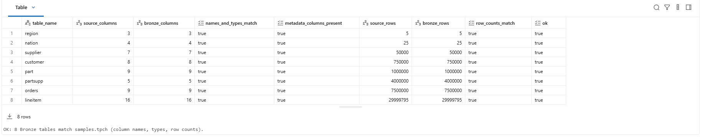
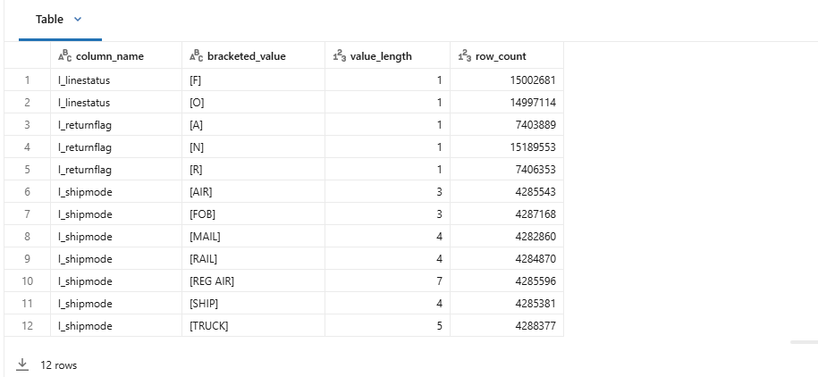

# Slide material — Nazar (Stage 1: foundation, Bronze, profiling)

Target: about 45 s of talk (demo-script step 1). Every number comes from the plan.md evidence log (2026-10-07).

---

## Slide 1 — One config, an as-is Bronze copy

- Repo: https://github.com/Badabuba/nachalniki-logistics (public) · `uv sync` for the local env
- `00_config`: 3 parameters (`catalog`, `schema_prefix`, `source`), from which come all schema names: `{catalog}.{prefix}_bronze … _audit`
  - no catalog, schema or row count is hard-coded anywhere else (checked by grep), so another workspace or prefix only needs different parameters (the portability run comes in Stage 3)
  - `new_run_id()` / `require_run_id()`: every run gets a fresh id, and steps can't run without one
- Bronze: all 8 TPC-H tables, `SELECT *` plus `_ingested_at` and `_source_table`
- Built-in check: column names, types and row counts are equal to the source → **8/8 tables match** (e.g. lineitem 29,999,795 rows)

Image: the check table of `01_bronze_ingest`, rendered from the Databricks run export of run `1104358970299952` (2026-10-07); not a live workspace screenshot.

Speaker notes: Everything starts from one config notebook. Its three parameters decide where we read and write, so the same code is meant to run in another workspace or under a second prefix, and nothing has row counts or names baked in. The full portability run is part of Stage 3. Bronze is a plain copy of the source with two traceability columns. The notebook itself proves this: it compares every table with the source and fails if any column, type or count differs. On our run all eight matched.

Evidence: NAZ-07 (A1, A4, A5), NAZ-08 rows of the plan.md evidence log.

---

## Slide 2 — Allowed values come from profiling, not from guessing

| Column | Observed in the data = TPC-H spec |
|---|---|
| `l_shipmode` | AIR, FOB, MAIL, RAIL, REG AIR, SHIP, TRUCK |
| `l_returnflag` | A, N, R |
| `l_linestatus` | F, O |

- Method: value counts + value lengths on Bronze → compare with TPC-H spec rev. 3.0.1 (§4.2.2.13, §4.2.3) → classify each value (observed and documented / documented only / observed only)
- Result: every value observed and documented, no NULLs, no stray whitespace → these lists became the constants used by validation
- Also confirmed for later stages: urgent priority = `1-URGENT`; 1–7 lines per order (median 4), no order without lines
- Challenge: the first write attempt failed with `PERMISSION_DENIED` (no `CREATE SCHEMA` on `workspace`). It worked only after admin rights were granted, so the README now lists that permission as a prerequisite

Image: the categorical value-count table of `profile_source`, rendered from the Databricks run export of run `1029034196915021` (2026-10-07); not a live workspace screenshot.

Speaker notes: The assignment asks us to build the allowed lists by profiling. We counted every distinct value, including its length so hidden spaces would show up, and checked each one against the TPC-H specification. Nothing unexpected appeared, so the lists are exactly the documented values. If a new value ever shows up, validation fails instead of quietly accepting or dropping it. Our main Stage 1 challenge was access: the first write was denied until we had schema-creation rights.

Evidence: NAZ-03 runs 1–2, NAZ-09, NAZ-10 rows of the plan.md evidence log; design.md §5.5 and §6.
