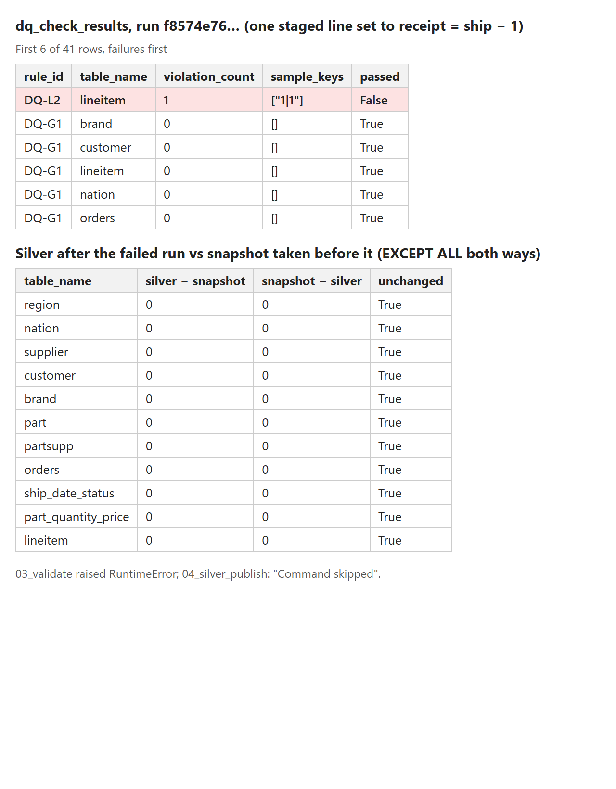
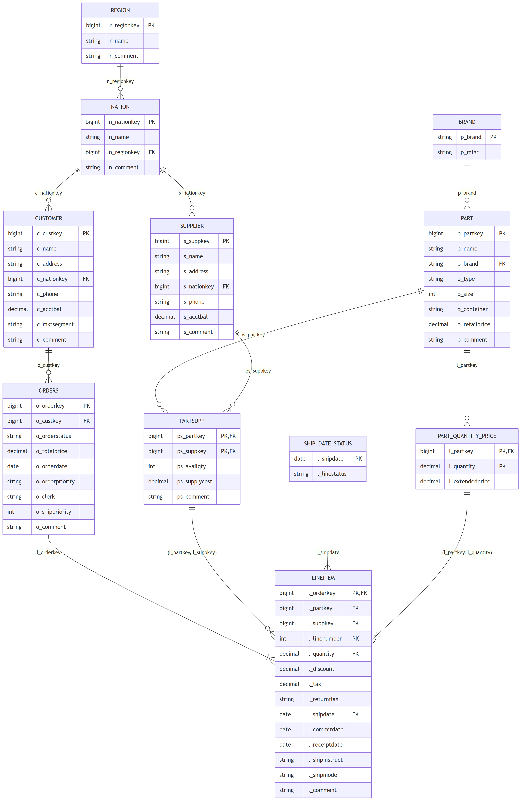

# Slide material — Stage 2 (Silver, 3NF and data quality)

Built by Max after taking over Yaropolk's Stage 2 tasks (D20). Target: about 1.5 min of talk (demo-script steps 3–4). Every number comes from the plan.md evidence log (2026-10-07).

---

## Slide 1 — Validate first, publish second

- `02_silver_stage`: Bronze → `{prefix}_staging`, casts and column selection only, **no row dropped**
- `03_validate`: 12 blocking rules → one row per rule and table in the append-only `{prefix}_audit.dq_check_results`
  - dates (DQ-L1–L4), allowed values from profiling (DQ-L5–L7), every line has an order and every order has lines (DQ-L8, DQ-L9)
  - keys and foreign keys of all 11 Silver tables (DQ-G1, DQ-G2), no row lost between source, Bronze and staging (DQ-G3)
  - late deliveries are valid data, so there is no lateness rule
- `04_silver_publish` runs only if all rules passed; then `NOT NULL` + `CHECK (receipt >= ship)` (enforced) and PK/FK (informational)
- Success run `159dd764…`: **41/41 result rows passed**, 11 tables published (lineitem 29,999,795 rows)
- Failure demo: one staged line received a day before it was shipped → **DQ-L2 failed (key `1|1`)**, publish skipped, Silver identical to its snapshot (0 rows differ in 11 tables)

Image: rendered from the decoded Databricks run exports of the failure-demo runs `163038100773182` (validation) and `871954388201545` (comparison), 2026-10-07; not a live workspace screenshot.

Speaker notes: Silver is never written directly. We first build a candidate in staging that keeps every Bronze row, then run all rules on it and store each result with up to ten sample keys. Only a full pass publishes Silver. To show it, we changed one line so it was received before it was shipped. Validation caught exactly that line, the run stopped before publishing, and comparing Silver with a snapshot taken beforehand showed no change at all.

Evidence: YAR-05, YAR-06, YAR-08 rows of the plan.md evidence log.

---

## Slide 2 — 3NF is proven on the dependencies, not assumed

| Dependency tested on the data | Result | TPC-H spec §4.2.3 | Action |
|---|---|---|---|
| `p_brand → p_mfgr` | holds | brand carries the manufacturer number | `brand` table |
| `l_shipdate → l_linestatus` | holds | `O` if shipped after 1995-06-17 | `ship_date_status` table |
| `(l_partkey, l_quantity) → l_extendedprice` | holds | `quantity × p_retailprice` | `part_quantity_price` table |
| `l_receiptdate → l_returnflag` | refuted (1,261 of 2,555 dates have R and A) | R/A random | none |

- Method: keys must be unique → each candidate `X → A` tested with `GROUP BY X HAVING count(DISTINCT A) > 1` → a dependency that holds **and** is a documented rule is a 3NF violation → decompose
- Result: 8 source tables → **11 Silver tables**; if the data ever broke one of these rules, the new table's key would be duplicated and DQ-G1 would block the run
- Challenge: copying a well-known schema does not prove 3NF. The specification turned out to define three non-key dependencies, so we had to split tables and move `l_linestatus` out of the `lineitem` contract (Gold never used it)
- Challenge: the serverless job retried the failing demo on its own, so the demo ran twice; both runs failed on DQ-L2 with their own `run_id`, which is why every check reads only the rows of its own run

Image: Mermaid render of `docs/silver_er.mmd`, checked against `information_schema.columns` of the published `makc_logistics_silver` (11 tables, 65 columns, 2026-10-07).

Speaker notes: For 3NF we did not rely on TPC-H being a textbook schema. We confirmed the keys and tested each likely dependency on the data, then looked each one up in the specification. Three of them hold and are generation rules, so they are real transitive dependencies; we moved each into its own table keyed by its determinant. The return flag looked like a dependency but the data refutes it. The ER diagram shows the eleven published tables.

Evidence: YAR-03, YAR-07 rows of the plan.md evidence log; design.md §5.3 and §5.5.
